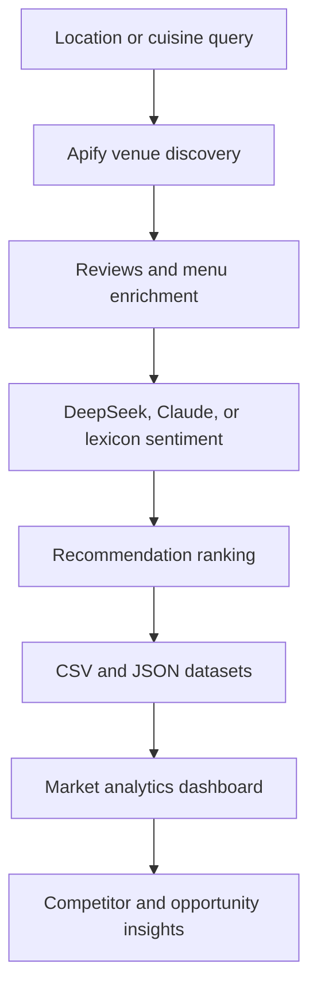

# 🍽️ Local Dining Intelligence

A reproducible restaurant discovery and market-intelligence product that combines Google Maps venue data, customer-review sentiment, competitive benchmarking, menu research, and category opportunity analysis.

The application works immediately with a built-in demo dataset. Apify, DeepSeek, and Anthropic integrations are optional enrichments—not prerequisites for evaluating the product.

## Product capabilities

- Search any cuisine and location through the CLI pipeline
- Collect venue details, reviews, menus, coordinates, and pricing signals
- Use DeepSeek, Claude, or a local lexicon sentiment fallback
- Rank restaurants using ratings, sentiment, and review confidence
- Explore restaurant competitors in an interactive Streamlit dashboard
- Identify category white-space signals using demand, saturation, and quality gaps
- Compare restaurants and inspect their geographic distribution
- Export normalized CSV and JSON datasets
- Run deterministically in demo mode without paid credentials
- Validate analytics through automated GitHub Actions tests

## Architecture



## Run the dashboard immediately

```bash
git clone https://github.com/MadanMohan0537/local-dining-intelligence.git
cd local-dining-intelligence
python -m venv .venv
```

Activate the environment:

```bash
# Windows
.venv\Scripts\activate

# macOS/Linux
source .venv/bin/activate
```

Then run:

```bash
pip install -r requirements.txt
streamlit run dashboard.py
```

The dashboard opens at `http://localhost:8501` and defaults to the built-in demo.

## Run a live restaurant search

Copy `.env.example` to `.env` and add an Apify token:

```ini
APIFY_API_TOKEN=your_token
SENTIMENT_PROVIDER=auto
DEEPSEEK_API_KEY=
ANTHROPIC_API_KEY=
OUTPUT_DIR=data
```

Examples:

```bash
python restaurant_scraper.py "Indian restaurants in Frisco, TX" --max-restaurants 15 --max-reviews 5 --no-push
python restaurant_scraper.py "Vegan restaurants in Boston, MA" --no-menu --no-push
python restaurant_scraper.py "Seattle, WA" --no-sentiment --no-push
```

After generating the dataset, open `streamlit run dashboard.py` and select **Latest saved dataset**.

## Intelligence methodology

### Restaurant score

The dashboard combines:

- 45% normalized Google rating
- 40% review sentiment
- 15% review-volume confidence

### Category opportunity signal

The opportunity view combines:

- 45% observed review demand
- 35% lower competitive saturation
- 20% category quality gap

These scores are directional research tools. They are not financial forecasts and should be validated with rent, foot traffic, delivery demand, and primary customer research.

## Output schema

Each export contains restaurant identity, address, coordinates, rating, review volume, price level, category, website, review samples, menu items, sentiment results, and recommendation ranking.

## Testing

```bash
pytest -q
python -m py_compile restaurant_scraper.py dining_analytics.py demo_data.py dashboard.py
```

## Responsible use

- Respect source-platform terms, rate limits, and applicable privacy requirements.
- Do not treat public reviews as verified demographic or personal information.
- AI sentiment is an imperfect decision-support signal and should be audited on representative review samples.
- Do not commit API keys or tokens. `.env` is ignored by Git.

## License

MIT


## Cloudflare deployment

The repository includes an edge-compatible application alongside the Python scraper and Streamlit dashboard:

- `public/index.html` — restaurant analytics dashboard with browser-private CSV/JSON uploads
- `worker/index.js` — synthetic demo analytics and health API
- `wrangler.jsonc` — Worker and static-assets configuration
- `package.json` — Cloudflare build and deployment scripts

Configure Cloudflare Workers Builds with:

```text
Production branch: main
Build command: npm install
Deploy command: npm run deploy
Root directory: leave blank
```

Do not enter `/` in the root-directory field.

The deployed application uses an edge-compatible JavaScript dashboard. The full Apify, DeepSeek/Claude, Python analytics, and Streamlit workflow remains available for local or container execution.
