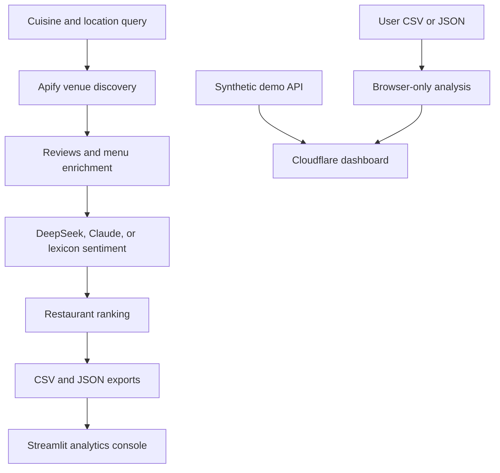

# 🍽️ Local Dining Intelligence

<p align="center">
  <strong>Restaurant discovery, customer sentiment, competitive benchmarking, and market-opportunity analysis in one reproducible platform.</strong>
</p>

<p align="center">
  <a href="https://local-dining-intelligence.madanmohanlearning.workers.dev/"></a>
  <a href="https://www.python.org/"></a>
  <a href="https://streamlit.io/"></a>
  <a href="https://apify.com/"></a>
</p>

<p align="center">
  <strong>🌐 <a href="https://local-dining-intelligence.madanmohanlearning.workers.dev/">Open the live dining-intelligence dashboard</a></strong>
</p>

---

## Overview

Local Dining Intelligence transforms restaurant listings, reviews, menus, ratings, pricing, and location data into decision-ready market insights. It can rank restaurants, compare competitors, measure customer sentiment, and identify category white-space signals for any supported market.

The repository includes two complementary applications:

1. **Cloudflare application:** a globally deployed, edge-compatible dashboard with a synthetic demonstration dataset and private CSV/JSON analysis.
2. **Python intelligence pipeline:** an Apify-powered scraper with DeepSeek, Anthropic Claude, or local lexicon sentiment analysis, normalized exports, and a richer Streamlit console.

## Live application

**Deployment:** [local-dining-intelligence.madanmohanlearning.workers.dev](https://local-dining-intelligence.madanmohanlearning.workers.dev/)

The live application provides:

- Restaurant count, average rating, customer-review volume, sentiment, and category KPIs
- Quality-versus-traction restaurant rankings
- Customer-sentiment-aware intelligence scores
- Category opportunity analysis
- Synthetic Boston demonstration data
- Browser-private CSV and JSON uploads
- Downloadable dataset template
- Responsive desktop and mobile interface

## Analyze your own restaurant data

Select **Upload data** in the live dashboard and choose a CSV or JSON file.

Privacy characteristics:

- Analysis runs entirely inside the browser.
- The file is never sent to the Cloudflare Worker.
- Uploaded data is not persisted, logged, or shared.
- Displayed text is escaped before rendering.
- Files are limited to 5 MB and 10,000 rows.

Supported JSON structures include a top-level array or an object containing `restaurants`, `records`, or `data`.

Recommended input columns:

```text
name, category, price_level, rating, reviews_count,
sentiment_score, address, latitude, longitude
```

If `sentiment_score` is missing, the live dashboard uses normalized rating as a transparent fallback. A ready-to-use CSV template is available in the interface.

## Intelligence methodology

### Restaurant intelligence score

The dashboard combines:

| Signal | Weight | Purpose |
|---|---:|---|
| Normalized Google rating | 45% | Observed customer quality |
| Review sentiment | 40% | Text-based customer experience |
| Review-volume confidence | 15% | Confidence and market traction |

### Category opportunity score

| Signal | Weight | Purpose |
|---|---:|---|
| Observed review demand | 45% | Customer activity in the category |
| Lower competitive saturation | 35% | Relative market white space |
| Category quality gap | 20% | Opportunity to outperform incumbents |

These values are directional research signals—not revenue, profitability, or investment forecasts. A real market decision should also consider rent, delivery demand, foot traffic, labor costs, demographics, and primary customer research.

## Architecture



## Core capabilities

- **Location-agnostic discovery:** search any supported cuisine, neighborhood, or city.
- **Restaurant enrichment:** collect ratings, reviews, categories, price levels, addresses, coordinates, websites, and menus.
- **Flexible sentiment providers:** use DeepSeek, Claude, or the included no-cost lexicon fallback.
- **Explainable ranking:** combine rating, sentiment, and review confidence using documented weights.
- **Market analysis:** compare competitors and identify lower-saturation category opportunities.
- **Dual export formats:** generate timestamped JSON and flattened CSV files.
- **Offline demonstration:** evaluate the product without API keys or paid services.
- **Cloud deployment:** run the public dashboard globally through Cloudflare Workers.

## Run the live-style Cloudflare application locally

```bash
git clone https://github.com/MadanMohan0537/local-dining-intelligence.git
cd local-dining-intelligence

npm install
npm run check
npm run dev
```

The Worker exposes:

| Endpoint | Purpose |
|---|---|
| `GET /health` | Cloudflare runtime health check |
| `GET /api/demo` | Synthetic restaurant dataset and calculated analytics |

## Run the Python and Streamlit platform

```bash
python -m venv .venv

# Windows
.venv\Scripts\activate

# macOS/Linux
source .venv/bin/activate

pip install -r requirements.txt
streamlit run dashboard.py
```

The Streamlit application opens at `http://localhost:8501` and initially uses the built-in demonstration data.

## Run a live restaurant search

Copy `.env.example` to `.env` and configure an Apify token:

```ini
APIFY_API_TOKEN=your_apify_token
SENTIMENT_PROVIDER=auto
DEEPSEEK_API_KEY=
ANTHROPIC_API_KEY=
OUTPUT_DIR=data
```

Examples:

```bash
python restaurant_scraper.py "Indian restaurants in Frisco, TX" --max-restaurants 15 --max-reviews 5 --no-push
python restaurant_scraper.py "Vegan restaurants in Boston, MA" --no-menu --no-push
python restaurant_scraper.py "Seattle, WA" --no-sentiment --no-push
python restaurant_scraper.py "Boston, MA" --demo --no-push
```

After generating a dataset, start `streamlit run dashboard.py` and select **Latest saved dataset**.

## Data pipeline

1. Interpret the free-form cuisine and location query.
2. Discover restaurants through the Apify Google Maps extractor.
3. Collect a bounded sample of recent customer reviews.
4. Enrich restaurants with menus and prices when available.
5. Run the configured sentiment provider or local fallback.
6. Calculate recommendation rankings.
7. Export normalized JSON and CSV datasets.
8. Explore results through the analytics dashboard.

## Repository structure

```text
restaurant_scraper.py    Apify discovery, reviews, menus, sentiment, exports
dining_analytics.py      Ranking, market KPIs, and opportunity calculations
dashboard.py             Full local Streamlit application
demo_data.py             Deterministic offline demonstration data
data/                    Example restaurant exports
tests/                   Analytics tests
worker/                  Cloudflare Worker API
public/                  Cloudflare-hosted web dashboard
wrangler.jsonc           Cloudflare configuration
package.json             Worker build and deployment scripts
```

## Deploy to Cloudflare

Cloudflare Workers build settings:

```text
Production branch: main
Build command: npm install
Deploy command: npm run deploy
Root directory: leave blank
```

Do not enter `/` in the root-directory field.

Manual deployment:

```bash
npm install
npm run deploy
```

## Testing

```bash
pytest -q
python -m py_compile restaurant_scraper.py dining_analytics.py demo_data.py dashboard.py
npm run check
```

GitHub Actions runs the Python test suite and syntax checks on pushes and pull requests.

## Responsible use

- Follow source-platform terms, rate limits, and applicable privacy requirements.
- Collect only the fields necessary for legitimate market research.
- Do not infer sensitive personal characteristics from public reviews.
- Treat model-generated sentiment as an imperfect analytical signal.
- Audit representative review samples before making business decisions.
- Validate opportunity scores with real operational and primary-research data.

## License

MIT License

